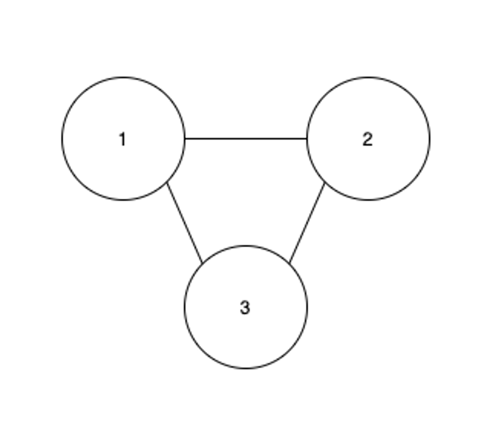
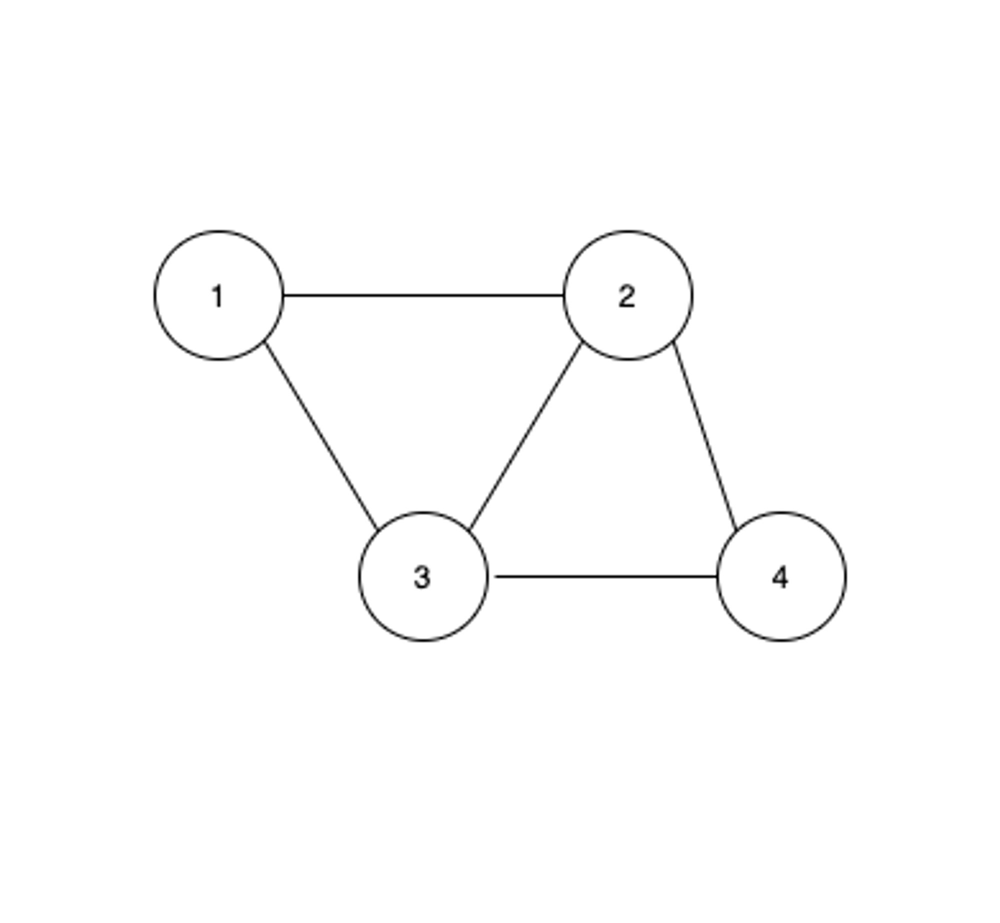
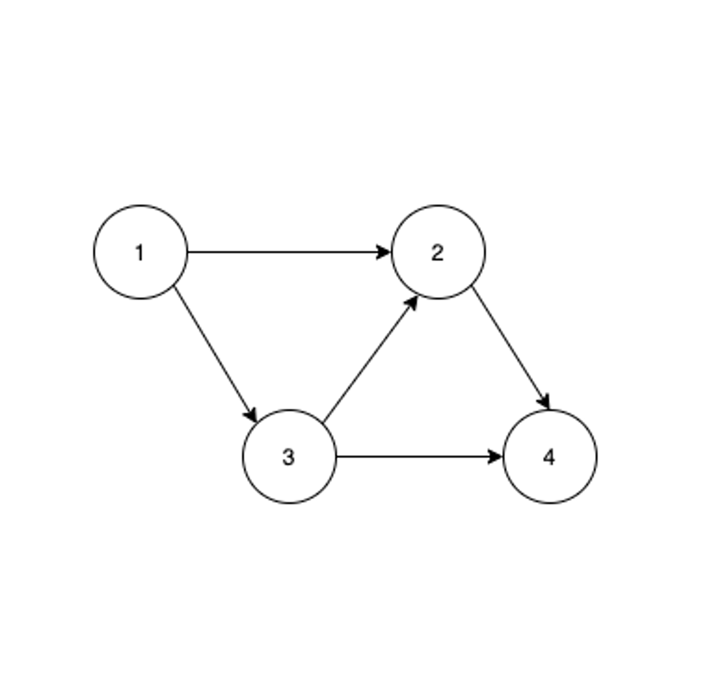
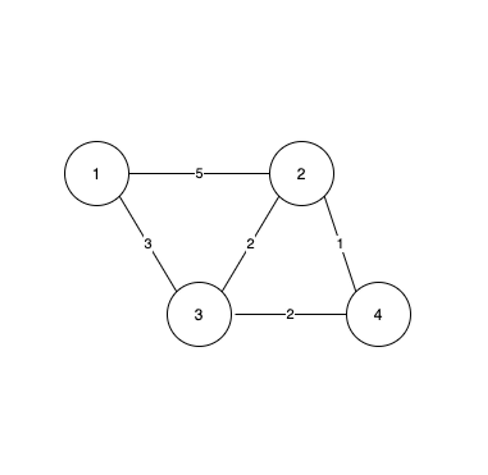
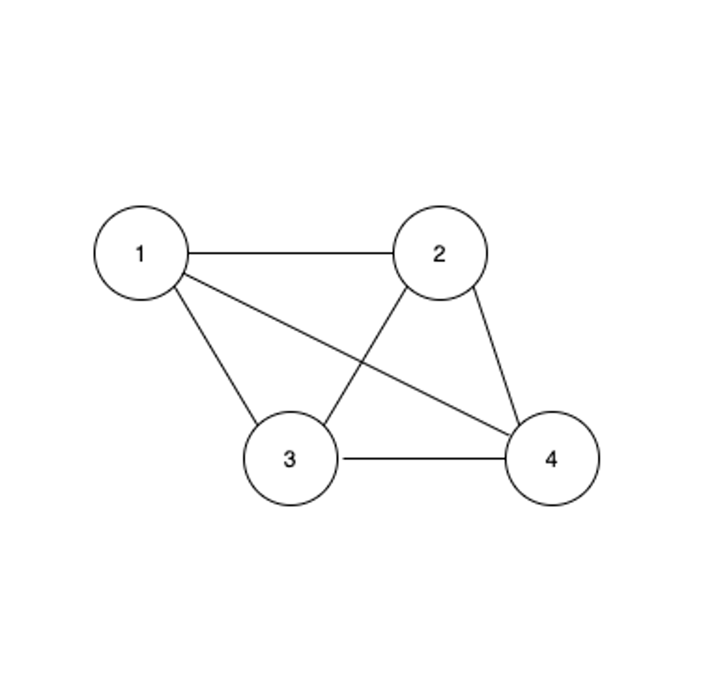
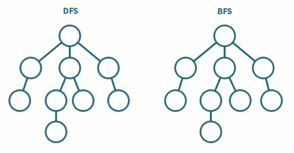

# **그래프(Graph)**

## **그래프란?**

그래프는 정점(node 또는 vertex)과 간선(edge)로 이루어진 자료구조이다.

사실 트리는 그래프의 일종이다. 하지만, 그래프는 트리와 달리 정점마다 간선이 존재하지 않을 수도 있으며, 루트 노드와 부모 노드, 자식 노드 개념이 존재하지 않는다.

위의 그림은 정점이 3개이고, 간선이 3개인 그래프이다.

## **그래프의 활용**

그래프는 연결되어 있는 객체 간의 관계를 표현할 수 있는 자료구조이다. 그래서 그래프는 실생활에서 지하철 노선도 최단 경로, 도로, 선수 과목 등에 쓰이고 있다.

**그래프 관련 용어**

| 용어                       | 뜻                                                                                                              |
| -------------------------- | --------------------------------------------------------------------------------------------------------------- |
| 정점(Vertex or Node)       | 데이터를 저장하는 위치                                                                                          |
| 간선(Edge)                 | 정점(노드)를 연결하는 선. 링크(Link) 또는 브랜치(branch) 로도 불린다.                                           |
| 인접 정점(adjacent vertex) | 간선에 의해 직접 연결된 정점을 의미한다. 위의 그림에서 1과 2는 인접 정점이다.                                   |
| 단순 경로(simple path)     | 경로 중에서 반복되는 정점이 없는 경우를 의미한다. 한붓 그리기와 같이 같은 간선을 지나가지 않는 경로를 의미한다. |
| 차수(degree)               | 무방향 그래프에서 하나의 정점에 인접한 정점의 수를 의미한다. 1의 차수는 2이다.                                  |
| 진출 차수(in-degree)       | 방향 그래프에서 외부로 향하는 간선의 수를 의미한다.                                                             |
| 진입 자수(out-degree)      | 방향 그래프에서 외부에서 들어오는 간선의 수를 의미한다.                                                         |
| 경로 길이(path length)     | 경로를 구성하는데 사용된 간선의 수를 의미한다.                                                                  |
| 사이클(cycle)              | 단순 경로의 시작 정점과 종료 정점이 동일한 경우를 의미한다.                                                     |

## **그래프의 종류**

**무방향 그래프**

무방향 그래프는 두 정점을 연결하는 간선에 방향이 없는 그래프이다.

**방향 그래프**

방향 그래프는 두 정점을 연결하는 간선에 방향이 존재하는 그래프이다.

간선이 가리키는 방향으로만 이동할 수 있다.

**가중치 그래프**

가중치 그래프는 두 정점을 이동할 때, 비용이 드는 그래프이다.

**완전 그래프**

완전 그래프는 모든 정점이 간선으로 연결된 그래프이다.

## **그래프 구현 방법**

그래프는 인접 행렬 또는 인접 리스트 로 구현할 수 있다.

**1. 인접 행렬**

인접 행렬이란 그래프의 정점을 2차원 배열로 만든 것이다.

정점 간에 직접 연결되어 있다면 1 , 아니라면 0 을 저장한다.

**장점**

1. 2차원 배열에 모든 정점의 간선 정보가 담겨있기 때문에 두 정점에 대한 연결을 조회할 때는 _O_(1) 의 시간 복잡도를 가진다.
2. 인접 리스트에 비해 구현이 쉽다.

**단점**

1. 모든 정점에 대해 간선 정보를 입력해야 하므로 인접 행렬을 생성할 때는 �(�2)_O_(*n*2) 의 시간 복잡도가 소요된다.
2. 항상 2차원 배열이 필요하므로 필요 이상의 공간이 낭비된다.

**2. 인접 리스트**

인접 리스트는 그래프의 노드를 리스트로 표현한 것이다. 주로 정점의 리스트 배열을 만들어서 관계를 설정한다.

**장점**

1. 정점들의 연결 정보를 탐색할 때 _O_(_n_) 시간 복잡도가 소요된다. (n 은 간선의 갯수)
2. 필요한 만큼 공간을 사용하기 때문에 인접 행렬에 비해 상대적으로 공간의 낭비가 적다.

**단점**

1. 특정 두 정점이 연결되어 있는지 확인하기 위해서는 인접 행렬에 비해 시간이 오래 걸린다.
2. 구현이 인접 행렬에 비해 어렵다.

## **그래프의 탐색**

**깊이 우선 탐색(DFS)**

- 갈 수 있는 만큼 최대한 깊이 가고, 더 이상 갈 곳이 없다면 이전 정점으로 돌아가는 방식으로 그래프를 순회한다.
- 주로 재귀 호출과 스택을 사용해서 구현한다.

**넓이 우선 탐색(BFS)**

- 시작 정점을 방문한 후, 시작 정점에 인접한 모든 정점을 방문한다.
- 인접한 정점을 방문한 뒤, 다시 해당 정점의 인접한 정점을 방문하며 그래프를 순회한다.
- 주로 큐와 반복문을 사용해서 구현한다.
